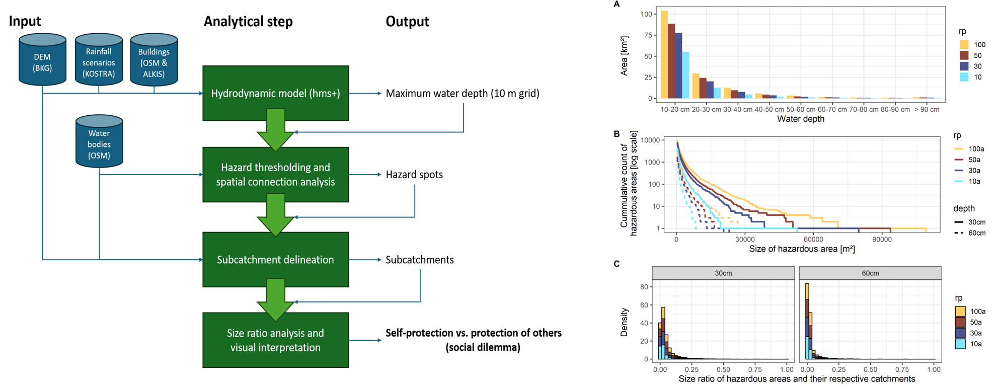

# berlin-flood-dilemma
Scripts and data related to a research article on the collective action problem in the context of decentralized urban pluvial flood adaptation (graphical abstract below).

The subfolder /scripts contains a flowchart that visualizes the processing chain with the respective inputs and outputs in each step. The Python environment can be built from the *.yml* file, while the used R libraries are documented in *R_sessionInfo.md*.

