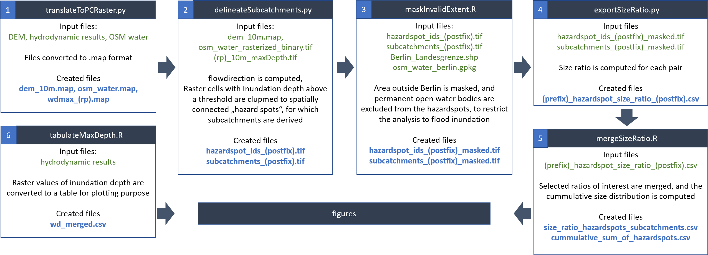

The input data licenses are listed in the table below. ALKIS and OpenStreetMap building shapes have been used to modify the ATKIS DEM for the hydrodynamic simulation, which is not part of this repository (please see the [Wahyd GitLab page here](https://git.tu-berlin.de/wahyd/hmspp/hms)). The resulting DEM as modified by us, as well as the maximum water depth from the hydrodynamic simulations, are provided in the subfolder data/raw. Water polygons from the OpenStreetMap dataset have been converted to a single layer .gpkg file and uploaded here as well. No modification other than format conversion has been applied to these data.

|Dataset   |Provider        |License     |Link      | Last Access |
|----------|----------------|------------|----------|-------------|
|ATKIS® DGM|Geoportal Berlin|dl-de/by-2-0|[link](https://www.berlin.de/sen/sbw/stadtdaten/geoportal/landesvermessung/geotopographie-atkis/dgm-digitale-gelaendemodelle/)|05-Feb-2025|
|ALKIS® Liegenschaftskataster|Geoportal Berlin|dl-de/by-2-0|[link](https://www.berlin.de/sen/sbw/stadtdaten/geoportal/liegenschaftskataster/)|05-Feb-2025|
|berlin-latest-free.shp|OpenStreetMap Contributors & Geofabrik GmbH|ODbL|[link](https://download.geofabrik.de/europe/germany/berlin.html)|05-Feb-2025|
|KOSTRA-DWD-2020|DWD|"ohne Nutzungseinschränkung"|[link](https://www.dwd.de/DE/leistungen/kostra_dwd_rasterwerte/kostra_dwd_rasterwerte.html)|16-Aug-2024|